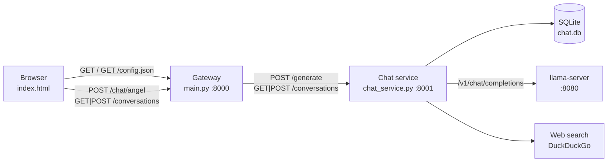
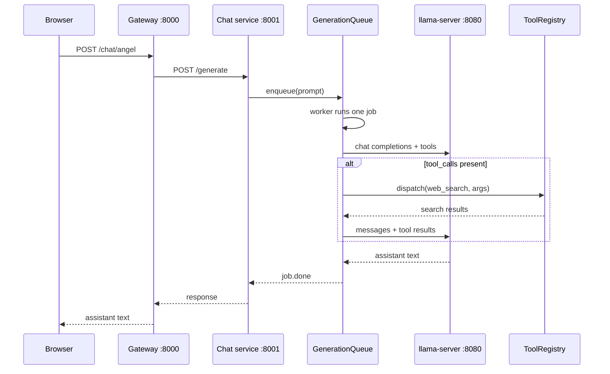
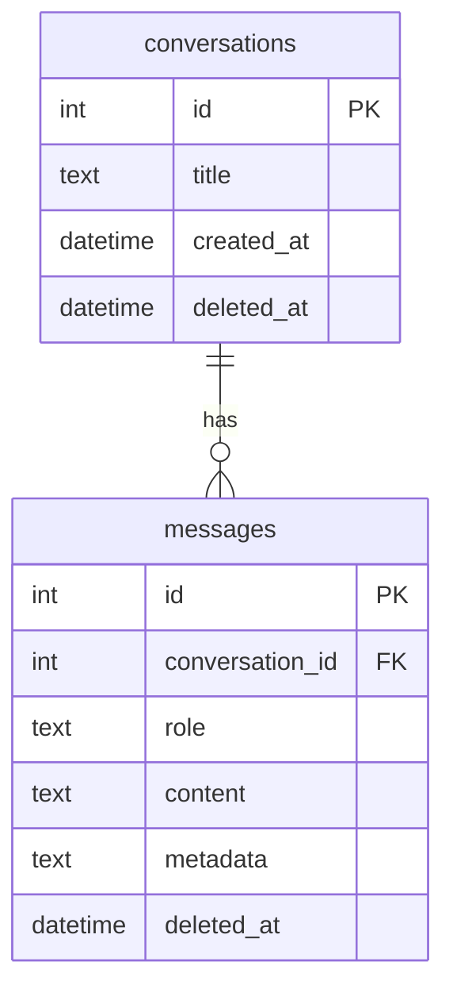

# Angel

Angel is a local AI companion for research and implementation work. It serves a simple chat UI, persists conversations in SQLite, and talks to a [llama.cpp](https://github.com/ggml-org/llama.cpp) server using OpenAI-style chat completions and tool calls.

The assistant can call `web_search` when facts may be stale or unknown, then continue generating with those results.

## Features

- Browser UI for creating conversations and sending messages
- FastAPI gateway (`main.py`) plus a dedicated generation service (`chat_service.py`)
- llama.cpp backend with OpenAI-compatible `/v1/chat/completions`
- Tool loop: the model may call `web_search` up to `max_tool_rounds` times per turn
- FIFO generation queue so llama.cpp and SQLite are used by one job at a time
- Structured request logging on the gateway (`RequestLog`)
- Mock chat endpoint for UI and API smoke tests without a model

## Architecture

Two FastAPI processes sit in front of llama.cpp. The gateway serves the UI and proxies chat/conversation traffic. The chat service owns the database, tools, and generation queue.



A generation request is queued, then processed serially. If the model returns tool calls, the service runs them and calls the model again until it replies with plain text or hits the round limit.



Queue jobs exist only in memory. Restarting the chat service drops queued work.

## Requirements

- Python 3.12+ recommended (3.10+ should work)
- [llama.cpp](https://github.com/ggml-org/llama.cpp) `llama-server` with a GGUF model
- Python packages used by this repo:

  ```text
  fastapi uvicorn httpx pydantic requests pytest
  ddgs   # or duckduckgo_search
  ```

Start `llama-server` with `--jinja` so OpenAI-style tool calls work. Models without a native tool template (including some Gemma builds) fall back to llama.cpp’s generic tool handler.

## Quick start

1. Install dependencies into a virtual environment.

   ```bash
   python -m venv .venv
   source .venv/bin/activate
   pip install fastapi uvicorn httpx pydantic requests pytest ddgs
   ```

2. Edit `config.json` so `llama.model` matches a model your server actually serves. To list loaded models:

   ```bash
   python scripts/getModelNames.py
   ```

3. Start llama.cpp (example; adjust host, port, and model path):

   ```bash
   llama-server --jinja --port 8080 -m /path/to/model.gguf
   ```

4. Start both FastAPI apps (separate terminals):

   ```bash
   uvicorn main:app --reload --port 8000
   uvicorn chat_service:app --reload --port 8001
   ```

5. Open [http://127.0.0.1:8000](http://127.0.0.1:8000). Interactive OpenAPI docs:

   - Gateway: [http://127.0.0.1:8000/docs](http://127.0.0.1:8000/docs)
   - Chat service: [http://127.0.0.1:8001/docs](http://127.0.0.1:8001/docs)

## Configuration

All runtime settings live in `config.json` (loaded by `config.py` at import time). The gateway also exposes this file at `GET /config.json` so the UI can read `api_base`.

| Key | Purpose |
| --- | --- |
| `database_path` | SQLite file used by the chat service (default `chat.db`) |
| `api_base` | Base URL the browser uses for gateway API calls |
| `chat_service_url` | Gateway → chat service URL |
| `llama.chat_url` | OpenAI-compatible chat completions endpoint |
| `llama.models_url` | Used by `scripts/getModelNames.py` |
| `llama.model` | Model id sent in completion requests |
| `llama.temperature` | Sampling temperature |
| `llama.max_tool_rounds` | Max tool-call loops before a final completion |
| `llama.system_prompt` | System message stored on new conversations |
| `web_search.default_max_results` | Default number of search hits |
| `web_search.max_results_cap` | Upper bound for `max_results` |

Change ports or hosts in `config.json` if you do not use the defaults (`8000` / `8001` / `8080`).

## Usage

### Chat UI

1. Open the gateway root URL.
2. Enter a title and click **Create** to add a conversation.
3. Select that conversation, type a message, and click **Send**.
4. The UI POSTs to `/chat/angel` and shows the assistant reply.

Create a conversation before sending. `/chat/angel` requires an existing `conversation_id`.

### Gateway API (`:8000`)

| Method | Path | Description |
| --- | --- | --- |
| `GET` | `/` | Chat UI (`index.html`) |
| `GET` | `/config.json` | Public copy of `config.json` |
| `POST` | `/chat/mock` | Echoes the prompt; no model, no persistence |
| `POST` | `/chat/angel` | Proxies generation to the chat service |
| `GET` | `/conversations` | Lists conversations |
| `POST` | `/conversations` | Creates a conversation; returns `{ "id": <int> }` |

Create a conversation:

```bash
curl -s -X POST http://127.0.0.1:8000/conversations \
  -H "Content-Type: application/json" \
  -d '{"title": "Research notes"}'
```

Send a message (replace `1` with the returned id):

```bash
curl -s -X POST http://127.0.0.1:8000/chat/angel \
  -H "Content-Type: application/json" \
  -d '{"prompt_text": "What is this project for?", "conversation_id": 1}'
```

Smoke-test the gateway without llama.cpp:

```bash
curl -s -X POST http://127.0.0.1:8000/chat/mock \
  -H "Content-Type: application/json" \
  -d '{"prompt_text": "hello", "conversation_id": 1}'
```

### Chat service API (`:8001`)

Call these when talking to the generation process directly. The UI should use the gateway.

| Method | Path | Description |
| --- | --- | --- |
| `GET` | `/` | Queue snapshot (`current`, `queued_count`, `jobs`) |
| `GET` | `/jobs` | Job list from the in-memory queue |
| `POST` | `/generate` | Enqueue a prompt and wait for the assistant text |
| `GET` | `/conversations` | List conversations from SQLite |
| `POST` | `/conversations` | Create a conversation |

`POST /generate` body:

```json
{
  "prompt_text": "Search for recent llama.cpp tool-call docs.",
  "conversation_id": 1
}
```

The HTTP handler waits until that job finishes. Other requests can still join the queue while a generation is running.

## How generation works

`LlamaCPPProvider.generate` in `providers.py`:

1. Loads the conversation from SQLite (or creates system + user messages if the id is new — prefer creating via `POST /conversations`).
2. Appends the user prompt and persists it.
3. Calls llama.cpp with the message history and OpenAI tool schemas from `ToolRegistry`.
4. If the assistant returns `tool_calls`, each call is dispatched (currently `web_search`), results are stored as `role: tool` messages, and the model is called again.
5. Stops when the model returns content with no tool calls, or after `max_tool_rounds` plus one final completion.

`GenerationQueue` runs `generate` in a worker thread (`asyncio.to_thread`) so blocking HTTP to llama.cpp does not freeze the event loop. A single worker means one generation at a time, which also keeps the shared SQLite connection safe.

## Data model

Schema bootstrap lives in `db.py`. See [docs/schema.md](docs/schema.md) for conventions.



Message `metadata` (JSON) examples:

- Assistant tool-call turns: `{"tool_calls": [...]}`
- Tool results: `{"tool_call_id": "...", "name": "web_search"}`

Rows with `deleted_at` set are ignored. The database file (`chat.db` by default) is gitignored.

## Tools

`ToolRegistry` exposes tools as OpenAI function definitions and dispatches by name.

| Name | Behavior |
| --- | --- |
| `web_search` | DuckDuckGo text search; `query` required; `max_results` optional |

Unknown tools, invalid JSON arguments, and search errors are returned as strings to the model rather than raising out of the loop.

## Tests

```bash
pytest
```

`ANGEL_TESTING=1` (set in `tests/conftest.py`) prevents the chat service from opening the on-disk database during import. Tests inject an in-memory SQLite connection and a scripted chat function, so they do not need llama-server.

## Project layout

```text
.
├── main.py              # Gateway: UI, proxy, mock chat, request logs
├── chat_service.py      # Generation API, queue lifespan, production DB
├── providers.py         # MockProvider and LlamaCPPProvider
├── job_queue.py         # In-process FIFO generation queue
├── tools.py             # ToolRegistry and WebSearchTool
├── db.py                # SQLite schema and light migrations
├── dtos.py              # PromptItem, ConversationCreate
├── config.py            # Loads config.json
├── config.json          # Runtime settings
├── request_log.py       # Structured start/complete/fail logs
├── index.html           # Chat UI
├── docs/schema.md       # Database notes
├── scripts/getModelNames.py
└── tests/               # Queue, tools, DB, generate pipeline, request logs
```

## Troubleshooting

| Symptom | Things to check |
| --- | --- |
| UI loads but send fails | Chat service on `:8001`; `chat_service_url` in `config.json` |
| Empty conversation list | Create a conversation first; gateway must reach the chat service |
| 4xx/5xx from `/chat/angel` | llama-server running; `llama.chat_url` and `llama.model` match the server |
| Tool calls ignored or malformed | Restart llama-server with `--jinja` |
| `web_search` errors in replies | Network access; `ddgs` / `duckduckgo_search` installed |
| Queue jobs disappear | Chat service restarted; jobs are not persisted |

Gateway handlers wrap proxied calls in `RequestLog`. Watch process logs for `request_id`, `endpoint`, `duration`, and `status`.
